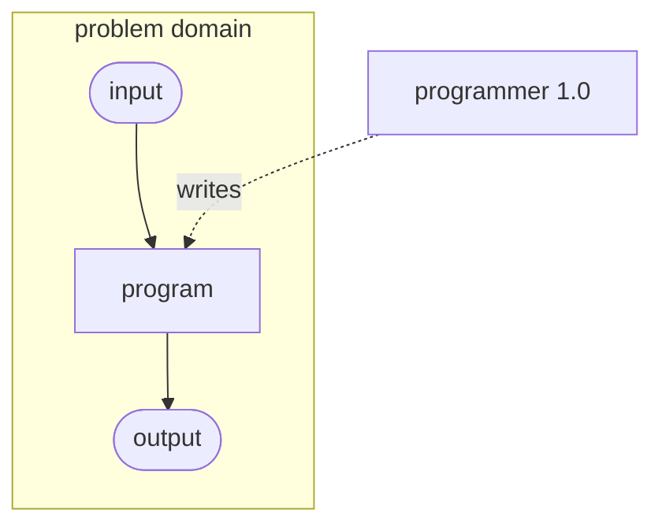
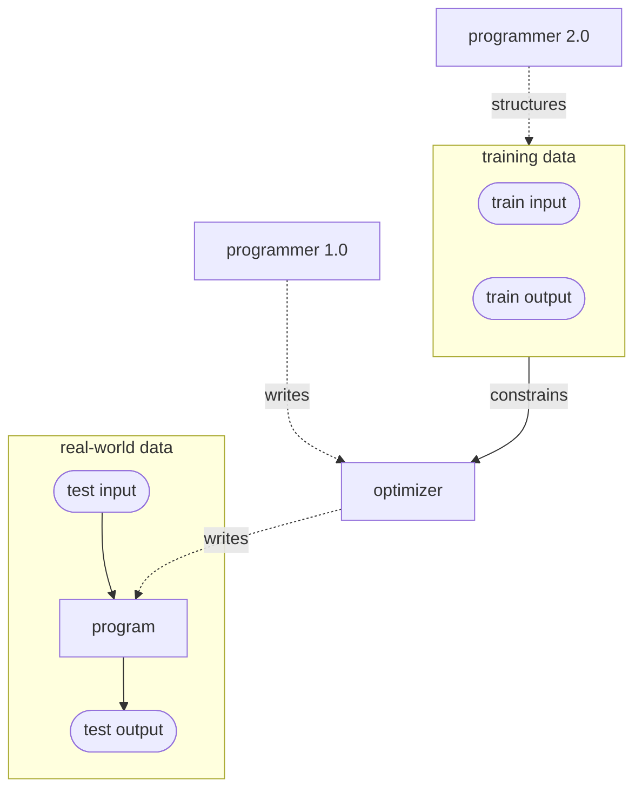

# Software 2.0 Sketch

What Would a Software 2.0 Programming Language Look Like?

## Setup

```bash
$ virtualenv .venv
$ source .venv/bin/activate
```

## What is this Project?

`software20` aims to provide a sketch of what a
["software 2.0"](https://blog.nodejs.dk/wp-content/uploads/2017/11/software-2-0-a64152b37c35)
programming language would look and feel like.

### Software 1.0

In a nutshell, "software 1.0" involves the type of programming we all know and
love: you have a problem whose solution can be framed as some set of
instructions that take input and produce an output, and the programmer goes
about explicitly writing down the instructions.



### Software 2.0

In "software 2.0", on the other hand, programming takes on a different flavor.
Instead of explicitly writing instructions, the programmer structures data
which constrains an optimization routine that finds the program for us.




## `software20`: what would software 2.0 look like?

### Inspiration: ML models 🤖 are "just" function approximators

Just as software 1.0 compiles the instructions that a programmer writes into
machine code, software 2.0 compiles data that has been structured by a programmer
into model "code" (e.g. weights in a neural net).

---

### What's in a Name?

It's hard to name things, but here are some alternatives to the "1.0", "2.0"
nomenclature:

| Software 1.0 | Software 2.0  |
--- | ---
| Instruction-oriented Programming | Optimization-oriented Programming |
| Deductive Programming | Inductive Programming |
| Explicit Programming | Intuitive Programming |

---

## Feature 🧠⛈

- multilayered API for software 1.0 programmer
  - easy to specify interface of the function
  - abstract away the model search problem (i.e. AutoML)
  - ability to customize internal architecture and optimization function.
  - provide visibility and metrics into the optimization process
- active learning interface for software 2.0 programmer
  - provide minimal data labelling interfaces for different function types
  - provide utilities for auto-labelling, data augmentation, and model
    debugging (think [snorkel](https://www.snorkel.org/))
  - automatic handling of serialization of data annotations (data as code)
  - facilitate feedback-loop for model re-training
